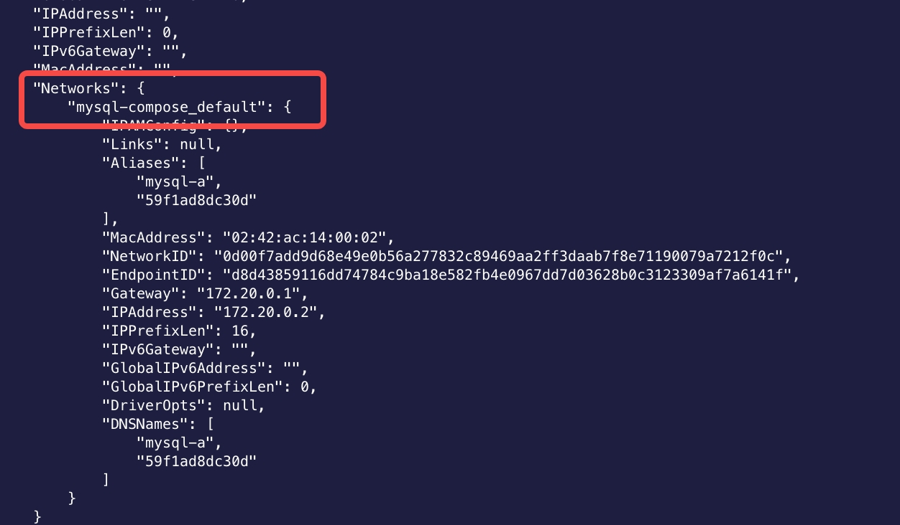

# mysql全量和增量备份 --- xtrabackup


> XtraBackup目前维护的大版本有两个(2.4和8.0)，之所以要维护两个版本，是因为MySQL 8.0中的redo log和数据字典的格式发生了变化。
>- XtraBackup 2.4，适用于MySQL 5.6和5.7。
>- XtraBackup 8.0。适用于 MySQL 8.0。

### 演示环境

| 服务 | 版本 |
|:------|:------|
| docker |  |
| docker-compose |  |


### 全量备份和恢复

运行的docker-compose.yml 如下

``` yaml
# 使用说明 V3
# docker-compose up
version: '3'
services:
  mysql-a:
    container_name: mysql-a
    hostname: mysql-a
    image: mysql:5.7.38
    restart: always
    ports:
      - 3307:3306
    environment:
      TZ: Asia/Shanghai
      MYSQL_ROOT_HOST: '%'
      MYSQL_ROOT_PASSWORD: shuqinkeji
      MYSQL_USER: test
      MYSQL_PASSWORD: shuqinkeji
    command:
      --default-authentication-plugin=mysql_native_password
      --max_connections=1000
      --character-set-server=utf8mb4
      --collation-server=utf8mb4_general_ci
      --default-time-zone='+8:00'
      --explicit_defaults_for_timestamp=true
      --lower_case_table_names=1
      --expire-logs-days=7
      # privileged: true
    logging:
      driver: "json-file"
      options:
        max-size: "100m"
    volumes:
      - ./data:/var/lib/mysql
      - ./logs:/var/log/mysql
      # - ./conf/my.cnf:/etc/mysql/conf.d/my.cnf
      # - ./init:/docker-entrypoint-initdb.d

  mysql-b:
    container_name: mysql-b
    hostname: mysql-b
    image: mysql:5.7.38
    restart: always
    ports:
      - 3308:3306
    environment:
      TZ: Asia/Shanghai
      MYSQL_ROOT_HOST: '%'
      MYSQL_ROOT_PASSWORD: shuqinkeji
      MYSQL_USER: test
      MYSQL_PASSWORD: shuqinkeji
    command:
      --default-authentication-plugin=mysql_native_password
      --max_connections=1000
      --character-set-server=utf8mb4
      --collation-server=utf8mb4_general_ci
      --default-time-zone='+8:00'
      --explicit_defaults_for_timestamp=true
      --lower_case_table_names=1
      --expire-logs-days=7
      # privileged: true
    logging:
      driver: "json-file"
      options:
        max-size: "100m"
    volumes:
      - ./data-b:/var/lib/mysql
      - ./logs-b:/var/log/mysql
      # - ./conf/my.cnf:/etc/mysql/conf.d/my.cnf
      # - ./init:/docker-entrypoint-initdb.d
```
my.conf

```
[mysqld]
pid-file        = /var/run/mysqld/mysqld.pid
socket          = /var/run/mysqld/mysqld.sock
datadir         = /var/lib/mysql
secure-file-priv= NULL

#gtid:
server_id = 11                   #服务器id
gtid_mode = on                  #开启gtid模式
enforce_gtid_consistency = on   #强制gtid一致性，开启后对于特定create table不被支持

#binlog
log_bin = mysql-binlog
log_slave_updates = on
binlog_format = row             #强烈建议，其他格式可能造成数据不一致

#relay log
skip_slave_start = 1
```
(1). 查看mysql服务器所在网络  
>`docker inspect mysql-a` 

>另外还有个更简单的方式就是通过--host参数直接指定当前服务器ip来登录，免去了查看mysql docker网络的步骤
    
(2). my.cnf文件和datadir位置
>这个用来让xtrabackup可以实现文件复制
>如果是在虚拟机上搭建的msyql，需要用使用数据卷挂载，然后使用参数指定，例如:   
> `--defaults-file=/opt/xtrabackup/mysql_conf/my.cnf  --datadir=/data/mysql `  
> 如果是通过docker搭建的，可以使用参数来继承mysql容器的数据卷  
> `--volumes-from mysql-a`

(3). 备份之后的文件路径  
>这个是用来指定存放备份文件的路径
>由于使用docker运行，这里单独配置数据卷挂载  
>`... -v /data/database/backups:/backups ... --target-dir=/backups/base  ...`
4. 执行备份账号的权限


#### 执行备份账号的权限
> 官方文档：https://docs.percona.com/percona-xtrabackup/2.4/using_xtrabackup/privileges.html  
> 要点总结：
> * 无论使用xtrabackup还是innobackupex，都涉及两个参与者:调用程序的用户(系统用户)和在数据库服务器中执行操作的用户(数据库用户)。请注意，这些是不同位置的不同用户，即使它们可能具有相同的用户名。
> * 一旦连接到服务器，为了执行备份，您将需要在服务器的datadir的文件系统级别上的READ和EXECUTE权限。
> * 创建具有完整备份所需的最低权限的数据库用户的SQL示例如下:
``` sql
mysql> CREATE USER 'back'@'%' IDENTIFIED BY 'backups';
mysql> GRANT SELECT, RELOAD, LOCK TABLES, PROCESS, REPLICATION CLIENT ON *.* TO 'back'@'%';
mysql> FLUSH PRIVILEGES;
```

回到主题---备份、恢复

> 官方文档：https://docs.percona.com/percona-xtrabackup/2.4/backup_scenarios/full_backup.html#creating-a-backup
> 要点总结：
> * 要创建备份，使用xtrabackup --backup选项运行xtrabackup。您还需要指定一个xtrabbackup --target-dir选项，这是备份存储的位置，如果InnoDB数据或日志文件没有存储在相同的目录中，您可能也需要指定它们的位置。如果目标目录不存在，xtrabackup将创建它。如果该目录不存在且为空，则xtrabackup将成功。Xtrabackup不会覆盖现有的文件，它将失败，操作系统错误17，文件存在。
> * 日志复制线程每秒检查事务日志，以查看是否有需要复制的新日志记录写入，但是日志复制线程可能无法跟上写入事务日志的数量，并且在日志记录被覆盖之前可能会遇到错误。
> * 根据数据库的大小，备份可能需要很长时间。在任何时候取消都是安全的，因为它不会修改数据库。

基于docker 全量备份命令
```
docker run --rm --network mysql-compose_default  -v /data/database/backups:/backups --volumes-from mysql-a percona/percona-xtrabackup:2.4 \
xtrabackup --backup --target-dir=/backups/base  \
--host=mysql-a --port=3306 --user=back --password='backups'
```
说明:
```
--rm                                                                # 执行完就删除该容器
--network mysql-compose_default                                     # 指定和mysql-a在同一docker网络
-v /data/database/backups:/backups                                  # 挂载备份目录数据卷
--volumes-from mysql-a                                              # 继承 mysql-a数据卷
xtrabackup --backup --target-dir=/backups/base                      # xtrabackup全量备份命令
--host=mysql-a --port=3306 --user=back --password='backups'         # 数据库登陆信息和凭证（默认端口3306可以不指定）
```

#### 准备备份

> 官方文档：https://docs.percona.com/percona-xtrabackup/2.4/backup_scenarios/full_backup.html#preparing-a-backup

> 要点总结：  
> 
> 准备的意义  
> 在使用xtrabackup --backup选项进行备份之后，首先需要准备备份以便恢复。在准备好数据文件之前，它们在时间点上是不一致的，因为它们是在程序运行时的不同时间复制的，并且在此期间它们可能已经被更改了。如果您尝试用这些数据文件启动InnoDB，它将检测损坏并自行崩溃以防止您在损坏的数据上运行。xtrabackup --prepare步骤使文件在一个瞬间完全一致，因此您可以在它们上运行InnoDB。  
> 
> 准备注意事项：  
> (1).您可以在任何机器上运行准备操作;它不需要位于原始服务器或打算恢复到的服务器上。您可以将备份复制到实用程序服务器并在那里进行准备。  
> (2).不建议在准备备份时中断xtrabackup进程，否则可能导致数据文件损坏，导致备份无法使用。如果准备过程中断，则不保证备份的有效性。  
> (3).备份文件的准备只能执行一次  
> (4).在准备操作期间，xtrabackup启动了一种嵌入其中的修改过的InnoDB(它所链接的库)。这些修改对于禁用InnoDB的标准安全检查是必要的，例如抱怨日志文件大小不合适，这不适合与备份一起工作。这些修改只适用于xtrabackup二进制文件;你不需要一个修改过的InnoDB来使用xtrabackup进行备份。准备步骤使用这个内嵌的InnoDB对复制的数据文件执行崩溃恢复，使用复制的日志文件。准备步骤使用起来非常简单:你只需运行xtrabbackup --prepare option并告诉它准备哪个目录  
> 5.您可以使用较旧的Percona XtraBackup版本与较新的Percona XtraBackup版本准备备份，但反之亦然。在不受支持的服务器版本上准备备份应该使用支持该服务器版本的最新Percona XtraBackup版本。例如，如果使用Percona XtraBackup 1.6创建了MySQL 5.0的备份，那么使用Percona XtraBackup 2.3准备备份是不支持的，因为Percona XtraBackup 2.1删除了对MySQL 5.0的支持。相反，应该使用2.0系列中的最新版本。  
>
> 基于docker 准备命令
```
docker run --rm -v /data/database/backups:/backups percona/percona-xtrabackup:2.4 \
xtrabackup --prepare  --target-dir=/backups/base
```
> 根据注意事项可知，准备步骤是xtrabackup启动了一种嵌入其中的修改过的InnoDB，所以跟mysql服务器没有任何关系，这里只要关联备份目录即可，准备步骤也不一定要在备份服务器，可以拷贝到任何服务器进行准备

#### 恢复备份

> 官方文档：https://docs.percona.com/percona-xtrabackup/2.4/backup_scenarios/full_backup.html#restoring-a-backup

> 要点总结：
>
>* 在恢复备份之前，datadir必须为空。还需要注意的是，在执行恢复之前需要关闭MySQL服务器。您不能恢复到正在运行的mysqld实例的数据目录(除非导入部分备份（ Partial Backups）)。  
>* 如果不想保存备份，可以使用xtrabackup --move-back选项，该选项将把备份的数据移动到datadir中。迁移完要注意文件权限问题。  
>* 如果您不想使用上述任何选项，您可以另外使用rsync或cp来恢复文件。(例如在要恢复的mysql环境没有docker或者没有安装xtrabackup)  
> `rsync -avrP /data/backup/ /var/lib/mysql/`  
> 最后别忘记检查恢复的文件是否具有正确的所有权和权限。  
> * 非docker场景命令  
> `chown -R mysql:mysql /var/lib/mysql`  
> * docker场景命令  
> `chown -R lxd:docker docker容器data目录`  
>* 启用relay-log-info-repository=TABLE后，从备份中恢复的实例在错误日志中有错误，为了避免这些类型的问题，在CHANGE MASTER To之前启用relay_log_recovery或执行RESET SLAVE。
中继日志信息已经备份，但是创建了一个新的中继日志，这会在恢复期间造成不匹配。

基于docker 恢复命令，需要注意的是执行命令之前需要 关闭mysql docker容器，清空myql容器datadir目录，执行恢复命令，再启动mysql容器


```
# 这里是将数据恢复到mysql-b
# 停止mysql-b
docker stop mysql-b
# 清空mysql-b 的数据目录
rm -rf ./data-b/*
# 恢复数据到`data-b`目录
docker run --rm -v /data/database/backups:/backups --volumes-from mysql-b percona/percona-xtrabackup:2.4 \
xtrabackup --copy-back  --target-dir=/backups/base --datadir=/var/lib/mysql 
# 启动
docker start mysql-b
```
> 恢复要指定datadir，所以这里继承了mysql容器的数据卷，其他和mysql服务器没关系

还有一点要注意就是要关注恢复的mysql和导出的mysql版本是否不一致，不一致的话需要执行升级命令来兼容新版本

查看mysql版本命令  
`select version();`  
升级数据库命令  
`mysql_upgrade -uroot -p`  

***
***

### 增量备份

#### 创建

> 官方文档：https://docs.percona.com/percona-xtrabackup/2.4/backup_scenarios/incremental_backup.html#creating-an-incremental-backup  
>
> 要点总结：
> 
> * 必须有完整备份才能恢复增量更改。如果没有完整备份作为基础，增量备份就毫无用处。增量备份读取页面，并将它们的LSN与上次备份的LSN进行比较。增量备份不会将数据文件与前一次备份的数据文件进行比较。因此，在进行部分备份（Partial Backups）后再进行增量备份，可能导致数据不一致。 
> * 在本例中，您可以看到to_lsn(最后一个检查点LSN)和last_lsn(最后一次复制的LSN)之间存在差异，这意味着在备份过程中服务器上有一些流量。  

> 查看检查点文件  
`cat xtrabackup_checkpoints`

```
backup_type = incremental
from_lsn = 4124244
to_lsn = 6938371
last_lsn = 7110572
compact = 0
recover_binlog_info = 1
```

基于docker增量备份命令
(1). 全量备份
```
docker run --rm --network mysql02_default  -v /data/database/backups:/backups --volumes-from mysql5.7-uat01 percona/percona-xtrabackup:2.4 \
xtrabackup --backup --target-dir=/backups/base  \
--host=mysql5.7-uat01 --port=3306 --user=root --password='123456' 
```
(2). 增量备份（基于全量）
 ```
 docker run --rm --network mysql02_default  -v /data/database/backups:/backups --volumes-from mysql5.7-uat01 percona/percona-xtrabackup:2.4 \
xtrabackup --backup --target-dir=/backups/inc1  --incremental-basedir=/backups/base \
--host=mysql5.7-uat01 --port=3306 --user=root --password='123456' 
```
(3). 增量备份（基于增量）
```
docker run --rm --network mysql02_default  -v /data/database/backups:/backups --volumes-from mysql5.7-uat01 percona/percona-xtrabackup:2.4 \
xtrabackup --backup --target-dir=/backups/inc2  --incremental-basedir=/backups/inc1 \
--host=mysql5.7-uat01  --user=root --password='123456' 
```
 

这步完成之后应该有以下目录
> /backups/base  
> /backups/inc1  
> /backups/inc2  

#### 准备
